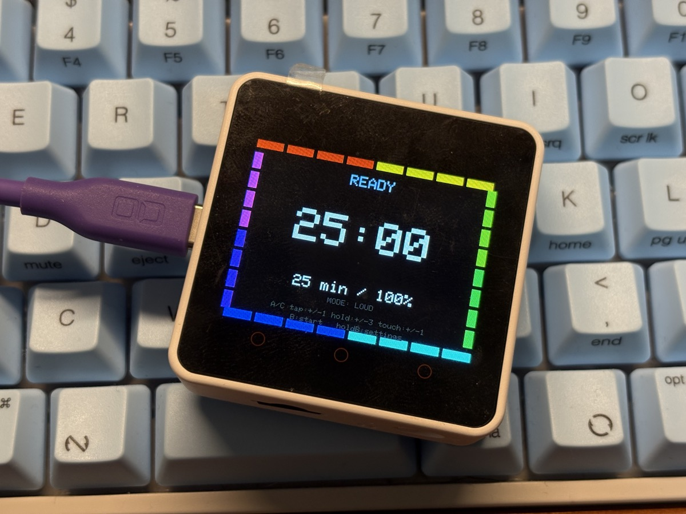

[English version](README.md)

# M5CORE2-VBT20-Timer

M5Stack Core2 で動作する、VBT20風ビジュアルタイマーです。

図書館・自習室などの静かな環境で、直感的に使えることを重視しています。

## 主な機能

- 画面外周4辺のセグメントゲージ表示
- レインボー表示（離散色ステップ）
- 12時位置を起点に時計回りで減少
- カウントダウン中は「次に消える1セグメント」だけ点滅
- タイマー状態管理: Ready / Running / Paused / Done
- タッチ操作（タップ/スワイプ）で分数調整
- ボタン長押しで高速調整（3分刻みなど）
- 通知モード:
	- Loud
	- Soft
	- Silent
	- Vibrate
- 設定画面で音ON/OFF・振動ON/OFFを切替
- 半分到達通知
- 終盤演出（暖色化・緩やかなアニメーション）
- 終了時の穏やかな画面フラッシュ通知

## 操作方法

### 通常画面

- Aボタン短押し: `-1分`
- Cボタン短押し: `+1分`
- A/C長押し: 高速調整（`BUTTON_HOLD_STEP_MINUTES` 分ずつ）
- Bボタン短押し:
	- Ready -> Start
	- Running -> Pause
	- Paused -> Resume
	- Done -> Reset
- Bボタン長押し（Ready時）: 設定画面へ
- Bボタン長押し（Ready以外）: タイマーリセット

### タッチ操作

- 左側タップ: `-1分`
- 右側タップ: `+1分`
- 横スワイプ:
	- 左スワイプ: `-1分`
	- 右スワイプ: `+1分`

### 設定画面

- A/C: 項目選択
- 画面タップ: 選択中項目の値を変更
- B: 通常画面へ戻る

設定項目:

- SOUND: ON/OFF
- VIBE: ON/OFF
- MODE: Loud / Soft / Silent / Vibrate

## 開発環境

- 対象ボード: M5Stack Core2
- フレームワーク: Arduino
- 使用ライブラリ: M5Unified

## ファイル構成

- `M5CORE2-VBT20-Timer.ino`: メインスケッチ
- `config.example.h`: 設定テンプレート
- `config.h`: ローカル設定（git管理対象外）

## 設定

ローカル設定手順:

1. `config.example.h` を `config.h` にコピー
2. 利用環境に合わせて値を調整

主な調整項目:

- 画面表示・輝度
- セグメント数/太さ/ギャップ
- レインボー色数
- 点滅間隔
- ボタン長押し加速
- タッチ感度
- フラッシュ周期・明るさ
- 振動レベル・時間

## 補足

- 本プロジェクトはクラウド/スマホ連携を前提にしていません。
- 毎日使う実用品として、静かさ・分かりやすさ・安定性を重視しています。
